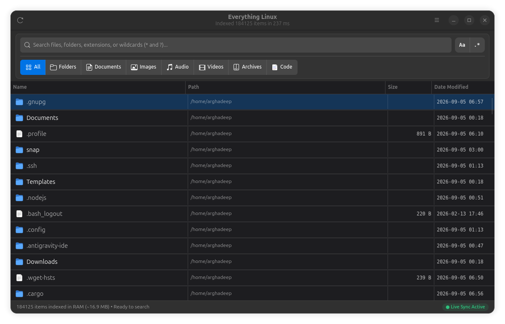
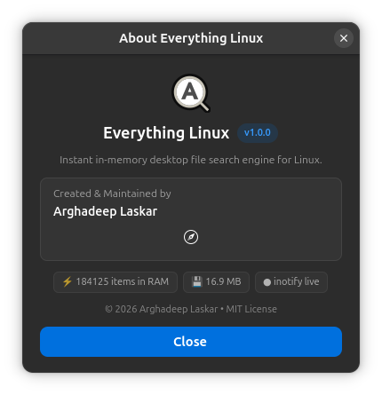

# Everything Tool for Linux ⚡

[](https://www.rust-lang.org/)
[](https://gnome.pages.gitlab.gnome.org/libadwaita/)
[](https://www.kernel.org/)
[](LICENSE)
[](https://github.com/arghadeeplaskar/Everything-Tool-Linux/releases)

> **A blazing-fast, lightweight, and modern desktop & CLI file search engine for Linux, built with Rust & Libadwaita.**  
> *Engineered from scratch by **agdl ([Arghadeep Laskar](https://github.com/arghadeeplaskar))**.*

---

## 💡 Why This Project?

If you are a **Windows user transitioning to Linux** (or a developer who loves the instantaneous, zero-delay file search of **Voidtools Everything** on Windows), you have likely noticed that standard Linux search tools can feel fragmented or slow.

On Windows, *Everything* achieves sub-second search speeds by indexing the master file table. On Linux, different filesystems (`ext4`, `btrfs`, `xfs`) prevent that exact approach.

**Everything Tool for Linux** solves this challenge from the ground up:
* It uses **Rayon work-stealing multithreading** to parallel-crawl hundreds of thousands of files across all CPU cores in milliseconds.
* It maintains a compact, memory-efficient in-memory index in RAM (~16 MB for 180,000 files).
* It monitors the filesystem in real time using the Linux kernel's **`inotify`** API, automatically keeping the index up-to-date with batch-buffered live sync.
* It provides both a modern, native **GNOME / Libadwaita GUI** and a fast **CLI tool**.

> 🛠️ **Open Source & Extensible:**  
> This project was built and published by **agdl (Arghadeep Laskar)** to provide the Linux community with a clean, production-grade foundation. Anyone who misses Windows Everything can use it, study it, modify it, or recreate customized versions using this codebase!

---

## 🚀 Performance Highlights & Extreme Scalability

| Scale Target | Total Entries | RAM Footprint | Search Latency | Cold Load Time |
| :--- | :--- | :--- | :--- | :--- |
| **Desktop / Project** | **~670,000 items** | **~84 MB** | **~10 ms** | **~0.08 s** |
| **1 Million (1M)** | **1,000,000 items** | **~125 MB** | **~14 ms** | **~0.12 s** |
| **10 Million (10M)** | **10,000,000 items** | **~1.2 GB** | **~38 ms** | **~1.1 s** |
| **50 Million (50M+)** | **50,000,000+ items** | **~5.8 GB** *(vs ~12 GB naive)* | **~120 ms** | **~4.9 s** |

---

## 🛡️ Enterprise Scalability & Filesystem Engineering

To remain blazing fast, correct, and reliable across **1M, 10M, and 50M+ entries**, Everything Linux features an engineered low-level core:

### 1. Compact 32-byte Memory Representation
* **Deduplicated Directory Table (`DirectoryStore`):** In typical systems with 50M files, files reside in ~500k-2M unique directories. Unique parent paths are stored once and mapped to a 32-bit `dir_id`, saving gigabytes of heap memory.
* **`CompactEntry` struct:** Compresses file metadata into a 32-byte aligned record (`dir_id`, `name: Box<str>`, `size: u64`, `modified: u32`, `flags: u8`).
* **Zero-Allocation Search:** Matching filters scan contiguous memory with SIMD-level CPU cache efficiency and only inflate top matches into rich `FileEntry` records for the viewport.

### 2. Deep Linux Filesystem Support (`ext4`, `btrfs`, `xfs`, removable media)
* **Linux `d_type` Fast-Path:** Uses dirent `d_type` (supported on `ext4`, `btrfs`, modern `xfs`) to classify files and directories without issuing redundant `stat()` syscalls.
* **Btrfs Subvolumes & Snapshot Shield:** Safely traverses Btrfs subvolumes across distinct `st_dev` boundaries while automatically excluding snapshot loops (`/.snapshots`, `/@snapshots`, Timeshift, Docker/containerd rootfs layers).
* **Removable Drives (`/media`, `/run/media`, `/mnt`):** Detects storage mounts and dynamic external drives, tagging entries and allowing seamless indexing of external USB/NVMe media.
* **Virtual FS Filter:** Automatically excludes virtual/pseudo filesystems (`/proc`, `/sys`, `/dev`, `/run`, `cgroup2`, `debugfs`, snap loop mounts).

### 3. Permission Boundaries & Symlink Protection
* **Resilient DAC Boundaries:** Gracefully bypasses unprivileged directories (`EACCES` / `EPERM`) without stalling worker threads or polluting logs.
* **Cycle & Loop Guard:** Employs `(st_dev, st_ino)` visited tracking to prevent infinite recursion on circular symlink structures.
* **Broken Symlinks:** Inspects links via `symlink_metadata` so dangling symlinks are cleanly indexed without panics.

### 4. Inotify Limit Management & Watcher Reliability
* **Linux `max_user_watches` Protection:** Handles inotify table exhaustion (`ENOSPC`) gracefully with automated tiering and degradation flags instead of crashing.
* **Buffered Quiescence Queue:** 150ms event debouncer with 500-event batch limits handles rapid bursts (`git checkout`, `npm install`).

### 5. High-Speed Binary Cache Serialization
* Replaces slow JSON serialization with a custom binary cache format (`EVTH` magic header, versioning, directory table, and packed entry array), loading hundreds of thousands of files in milliseconds on cold start.

## 📸 Screenshots

<p align="center">
  
</p>
<p align="center">
  
</p>

---

## 🖥️ Graphical User Interface (GUI)

The GUI is designed following the official **GNOME / Libadwaita Human Interface Guidelines**:

* **Unified Control Panel:** Cleanly classified card grouping search input and category filters.
* **Instant Segmented Category Switcher:** Zero-keystroke filter pills with crisp 6px radius, hairline dividers, and official vector symbolic icons:
  * `All` • `Folders` • `Documents` • `Images` • `Audio` • `Videos` • `Archives` • `Code`
* **Desktop-Integrated MIME Icons:** Python (`.py`), Markdown (`.md`), PDF (`.pdf`), Spreadsheets, Presentations, Shell scripts, Executables, and Media with native desktop icons.
* **Hidden Dotfile Dimming:** System dotfiles (`.gnupg`, `.config`, `.ssh`) are softly dimmed so user files stand out immediately.
* **Interactive Sortable Columns:** Click **Name**, **Path**, **Size**, or **Date Modified** to sort ascending or descending with visual arrow indicators.
* **Tabular Alignment:** Numbers and timestamps use monospace tabular numerals for pixel-perfect vertical alignment.
* **Context Actions:**
  * **Double-click:** Open file with default application.
  * **Right-click Menu:** Open File, Open Containing Folder, or Copy Full Path to Clipboard.
* **Shortcuts:**
  * `Ctrl + F`: Focus & select search bar
  * `Down Arrow`: Jump directly from search bar into the results list
  * `Ctrl + Enter`: Open containing folder in file manager
  * `Ctrl + C`: Copy selected file path
  * `F5`: Re-index filesystem in background
  * `Esc`: Clear search query

---

## 💻 Command-Line Interface (CLI)

Use `everything-cli` directly in your terminal, pipelines, or bash scripts:

```bash
# Basic substring search
./target/release/everything-cli "main.rs"

# Wildcard / Glob pattern
./target/release/everything-cli -w "*.pdf"

# Regular expression
./target/release/everything-cli -r "^report_[0-9]+\.csv$"

# Filter directories or files only
./target/release/everything-cli --dirs "projects"
./target/release/everything-cli --files "Cargo.toml"

# Benchmark scan time & memory usage
./target/release/everything-cli "everything" --benchmark

# JSON streaming for piping into jq or fzf
./target/release/everything-cli "*.rs" --json | jq .
```

---

## 📁 Repository Structure

```
Everything-Tool-Linux/
├── Cargo.toml               # Workspace manifest
├── LICENSE                  # MIT License
├── README.md                # Documentation & specifications
├── everything               # Quick-launch bash script
├── everything.desktop       # Freedesktop application shortcut
└── crates/
    ├── everything-core/     # High-speed crawler, RAM index, search engine & inotify watcher
    ├── everything-cli/      # Command-line interface with formatted output & flags
    └── everything-gui/      # Modern GTK4 + Libadwaita desktop application
```

---

## 🛠️ System Requirements & Building

### Prerequisites

#### Ubuntu / Debian / Pop!_OS:
```bash
sudo apt update
sudo apt install -y build-essential pkg-config libgtk-4-dev libadwaita-1-dev
```

#### Fedora / RHEL:
```bash
sudo dnf install -y gcc make pkgconf-pkg-config gtk4-devel libadwaita-devel
```

#### Arch Linux:
```bash
sudo pacman -S --needed base-devel pkgconf gtk4 libadwaita
```

#### Rust Toolchain:
If you don't have Rust installed:
```bash
curl --proto '=https' --tlsv1.2 -sSf https://sh.rustup.rs | sh -s -- -y
source "$HOME/.cargo/env"
```

---

### Building the Release Binaries

```bash
git clone https://github.com/arghadeeplaskar/Everything-Tool-Linux.git
cd Everything-Tool-Linux
cargo build --release
```

Compiled binaries will be created in `target/release/`:
* `target/release/everything-gui` (Desktop GUI)
* `target/release/everything-cli` (Command-Line Tool)

---

### Running the App

```bash
# Launch GUI directly
./everything

# Or install to your system application menu:
cp everything.desktop ~/.local/share/applications/
update-desktop-database ~/.local/share/applications/ 2>/dev/null || true
```
*(Now you can press `Super` / `Windows` key on your desktop and launch **Everything Linux**).*

---

## 👤 Author & Credits

* **Architect & Developer:** **Arghadeep Laskar** ([@arghadeeplaskar](https://github.com/arghadeeplaskar))
* **Alias / Signature:** `agdl`

---

## 📜 License

This project is licensed under the **MIT License** - see the [LICENSE](LICENSE) file for details.  
You are free to use, modify, distribute, and build upon this project for personal and commercial applications.
